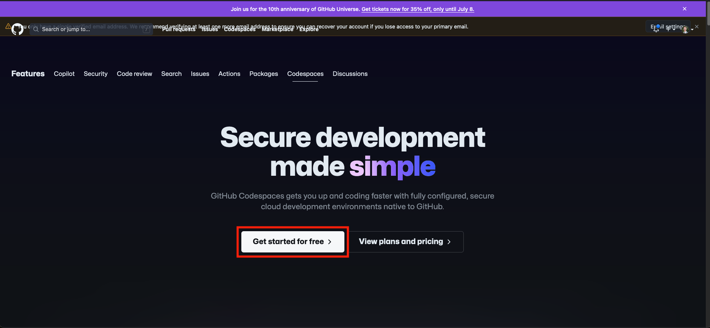
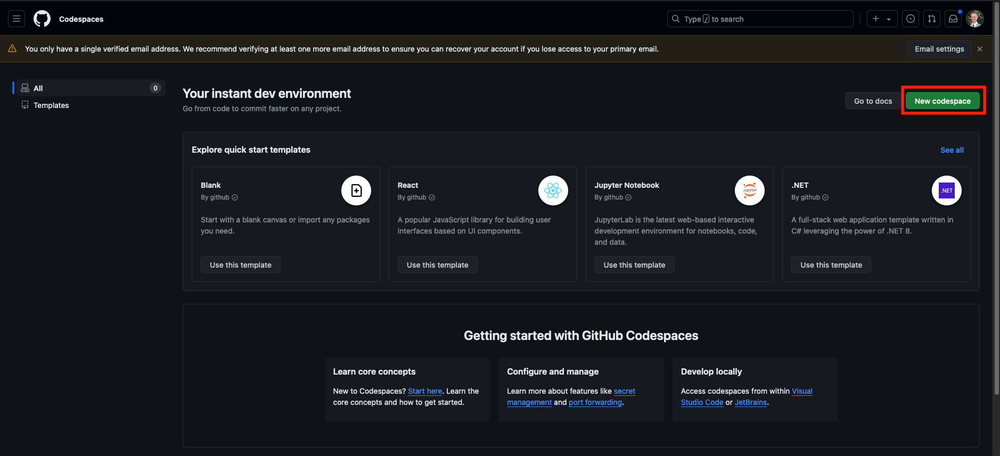
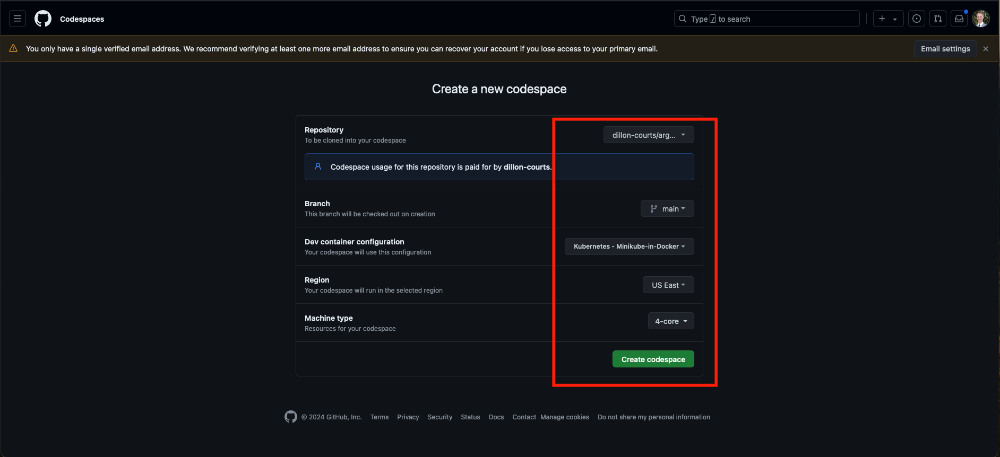

# Workshop

## Prerequisites

You have 2 options for this workshop. Only choose one!

### 1. Local Desktop
- Visual Studio Code version that can run dev containers
- Docker Desktop
- Github account

### 2. Github Code Spaces
- Github account with at least 1.5 hours left of the free 4 core tier.

## Fork repository

### 1. Local Desktop
1. Fork this repository into your github account and check it out on your machine.

Open this project in VSCode and then re-open in a dev container.


### 2. Github Code Spaces

1. Go to [codespaces](https://github.com/features/codespaces)
2. Click `Get started for free`

3. Click `New Codespace`

4. Select the following options
- Repository: `The forked argocd-demo repo`
- Branch: `main`
- Dev container configuration: `Kubernetes - Minikube-in-Docker`
- Region: `US East`
- Machine type: `4-core`


Wait for the codespace to inititialize.
## Install Argo

From here on out the instructions should apply to either codespaces or local with one exception:
- Any references to `localhost` will need to be replaced by the url for your specific codespace. Visual studio code in the browser should help guide you in this by offering to open forwarded ports in a browser.

Open a terminal within VSCode and follow the steps below.

1. Start the minikube cluster
```
minikube start
```
2. Create argocd namespace
```
kubectl create namespace argocd
```
3. Install argocd into the cluster
```
kubectl apply -n argocd -f https://raw.githubusercontent.com/argoproj/argo-cd/stable/manifests/install.yaml
```
- One more step for Github Codespace users only. This disables tls for the argocd server to allow access from the public url codespaces exposes. Run the following command:
```
    kubectl patch deployment argocd-server -n argocd --type='json' -p='[{"op": "add", "path": "/spec/template/spec/containers/0/args/-", "value": "--insecure"}]'

```
- Wait for the new pod to come up. Run the following until you see the new one is up and old has cycled off.
```
kubectl -n argocd get pods
```
4. Port forward the argocd UI to port 8080
```
kubectl port-forward svc/argocd-server -n argocd 8080:443
```
The API server can then be accessed using https://localhost:8080.
NOTE: This is a self signed cert, you may need to tell your browser to trust it.

5. Obtain the default password
```
argocd admin initial-password -n argocd
```
6. Login via the argocd CLI
```
argocd login localhost:8080
```
Username: admin

Password: <obtained in step 5>

7. Change the password if you'd like
```
argocd account update-password
``` 
8. Login to the UI at https://localhost:8080
```
User: admin
Password: <your_password>
```

## Deploy an Application

To get started we will deploy an application via the argocd UI.

1. Open the UI at https://localhost:8080 and login with the username and password you set up before.
2. Click `+ NEW APP`
3. Fill in the following information:
- `General` Section
  - Applicaiton Name: `adservice`
  - Project Name: select `default`
  - Sync Policy: select `Automatic`
- `Source` Section
  - Repository URL (use your forked url): `https://github.com/dillon-courts/gcp-microservices-deployment`
  - Path: `adservice`
- `Destination` Section
  - Cluster URL: Select `https://kubernetes.default.svc`
  - Namespace: `default`
4. Click `CREATE` in the top left corner
5. You should see your new app and after a short time it will be marked as Synced and appear healthy.
6. Back in VSCode run `kubectl get all` from your terminal to view the resources generated by the argo app.
7. Go back into the UI and delete the app, we are going to recreate it in the next section.

## Deploy a Microservice Demo

We are going to deploy a microservices demo project that consists of 11 services.

1. Open terminal and run
```
chmod +x create-argo-apps.sh
./create-argo-apps.sh <url of the this repository in your github account> #ex: ./create-argo-apps.sh https://github.com/dillon-courts/argocd-demo
```
2. The script will create an argo application for each of the directories in this project and automatically sync them to your minikube cluster.
3. You can view all the apps in the argo UI.
4. Port forward the frontend
```
kubectl port-forward svc/frontend 8000:80
```
5. View the ecommerce website on http://localhost:8000

## Update a Deployment

1. Open the file `frontend/deployment.yml`
2. Comment out line 35 and uncomment the correct line for your machine:
    - Local m1 mac: `green.2`
    - Everything else: `green.2.amd64`uncomment line 36. 

This will modify which image the deployment is pointing to.

3. Push the change to your repository.
    1. `git commit -a -m "update frontend image"`
    2. `git push`
4. Wait for argocd to sync it or force a sync by clicking the `refresh` or `sync` buttons in the UI.
5. You will likely need to restart your port forwarding.
6. Navigate to the website to see the changes! Note you may need to hard refresh your browser to clear any cache.

## Rollback the deployment

1. Open the UI and navigate to the frontend argo instance
2. Click `History and Rollback`
3. Find the deployment you want to rollback to, click the menu buttons, and click rollback
4. You will be prompted that auto-sync must be disabled. Continue and watch as argo rolls back to the previous deployment.
5. Once the pod is up refresh the website again to see it back in the original state
    - Note you may have to restart the port-forward from earlier
    - `ctl+c` to kill the current port-forward
    - `kubectl port-forward svc/frontend 8000:80`
